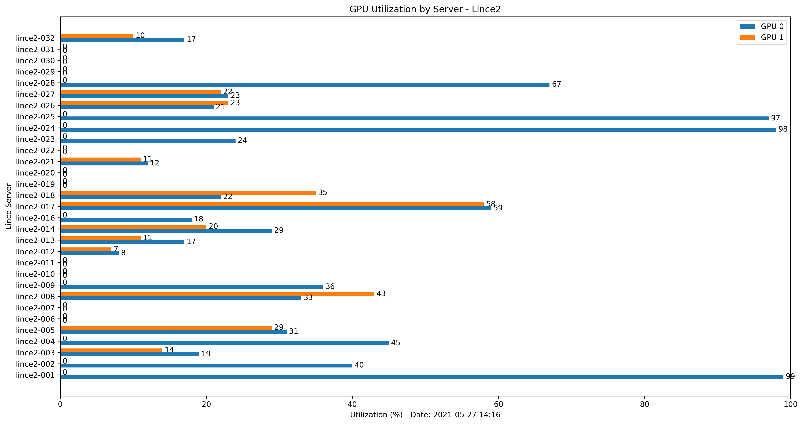

GPU Health Check
================

Each **lince** server has 2 NVIDIA Tesla GPUs installed. This cluster should be used to run GPU jobs; if you don't need GPU then use **aguia** instead.

You may check the GPU usage with the ``nvidia-smi`` command in any server except the login server which is used only for job scheduling.

Example of GPU using 67MiB of memory usage, 74% and 0% utilization on GPU 0 and 1 respectively and process ID 29150::

    $ nvidia-smi
    Sun May  2 16:54:50 2021
    +-----------------------------------------------------------------------------+
    | NVIDIA-SMI 418.67       Driver Version: 418.67       CUDA Version: 10.1     |
    |-------------------------------+----------------------+----------------------+
    | GPU  Name        Persistence-M| Bus-Id        Disp.A | Volatile Uncorr. ECC |
    | Fan  Temp  Perf  Pwr:Usage/Cap|         Memory-Usage | GPU-Util  Compute M. |
    |===============================+======================+======================|
    |   0  Tesla K20m          Off  | 00000000:05:00.0 Off |                    0 |
    | N/A   68C    P0   106W / 225W |     78MiB /  4743MiB |     74%      Default |
    +-------------------------------+----------------------+----------------------+
    |   1  Tesla K20m          Off  | 00000000:83:00.0 Off |                    0 |
    | N/A   30C    P8    16W / 225W |      0MiB /  4743MiB |      0%      Default |
    +-------------------------------+----------------------+----------------------+

    +-----------------------------------------------------------------------------+
    | Processes:                                                       GPU Memory |
    |  GPU       PID   Type   Process name                             Usage      |
    |=============================================================================|
    |    0     29150      C   ...gramas/intel/gromacs-5.1.4-cuda/bin/gmx    67MiB |
    +-----------------------------------------------------------------------------+
    

Message "No running processes found" on idle GPUs::

    $ nvidia-smi
    Sun May  2 16:55:18 2021
    +-----------------------------------------------------------------------------+
    | NVIDIA-SMI 418.67       Driver Version: 418.67       CUDA Version: 10.1     |
    |-------------------------------+----------------------+----------------------+
    | GPU  Name        Persistence-M| Bus-Id        Disp.A | Volatile Uncorr. ECC |
    | Fan  Temp  Perf  Pwr:Usage/Cap|         Memory-Usage | GPU-Util  Compute M. |
    |===============================+======================+======================|
    |   0  Tesla K20m          Off  | 00000000:05:00.0 Off |                    0 |
    | N/A   36C    P8    25W / 225W |     11MiB /  4743MiB |      0%      Default |
    +-------------------------------+----------------------+----------------------+
    |   1  Tesla K20m          Off  | 00000000:83:00.0 Off |                    0 |
    | N/A   28C    P8    16W / 225W |      0MiB /  4743MiB |      0%      Default |
    +-------------------------------+----------------------+----------------------+

    +-----------------------------------------------------------------------------+
    | Processes:                                                       GPU Memory |
    |  GPU       PID   Type   Process name                             Usage      |
    |=============================================================================|
    |  No running processes found                                                 |
    +-----------------------------------------------------------------------------+
    $

Example of error message::

    $ nvidia-smi
    Unable to determine the device handle for GPU 0000:05:00.0: GPU is lost.  Reboot the system to recover this GPU

Check all servers
-----------------

A more practical way to check the GPU usage in all servers is using a script. The ``gpu_mon.py`` script connects to each server and checks the GPU status. Then, it prints a list of servers with idle and falty GPUs and creates a bar plot::

	$ python gpu_mon.py
	===== Idle GPUs ==========
	lince2-001.hpc.usp.br
	lince2-009.hpc.usp.br
	lince2-011.hpc.usp.br
	lince2-021.hpc.usp.br
	lince2-022.hpc.usp.br
	===== Faulty GPUs ==========
	lince2-008.hpc.usp.br
	lince2-011.hpc.usp.br
	

gpu_mon script::

	#!/scratch/11568881/miniconda3/bin/python
	"""
	This module collects GPU utilization on all servers in lince cluster. This is useful to help
	identify possible improvements in job speed and free resources for other users.
	Ideally GPU utilizatin should be high for the most part of the time.

	Process:
	1. Connect to all servers, collect GPU utilization and save in a log file.
	2. Read the log file and create a data frame with server and GPUs 0 and 1 utilizations.
	3. Create a horizontal bar chart.
	4. Save the plot and data frame.
	"""
	import os, re, datetime, tempfile
	import numpy as np
	import pandas as pd
	import matplotlib.pyplot as plt

	# Connect to each server and collect GPU information.
	# Result is saved in a log file.
	def gpustatus(logfile):
		if os.path.exists(logfile):
			os.system('rm ' + logfile)
		for n in range(1, 32):
			s = ("000" + str(n))[-3:]
			os.system('ssh lince2-{} "hostname;nvidia-smi|egrep \'Tesla|%|Unable|No running processes found\'" >> {}'.format(s, logfile))

		return
		
	# Opens the log file and check the GPU utilization and availability.
	# Print the list of servers with idle GPU and GPU down.
	def procfile(logfile):
		gpu = {}
		nogpu = []
		gpudown = []
		df = pd.DataFrame(columns = ['Server', 'GPU 0', 'GPU 1'])
		with open(logfile, 'r') as f:
			rows = f.readlines()
			for row in rows:
				#lince2-001.hpc.usp.br
				server_re = re.search(r'(lince\d-(\d+))\.hpc', row)
				#|   0  Tesla K20m          Off  | 00000000:05:00.0 Off |                    0 |
				gpuId_re = re.search(r'\|\s+(\d)\s+Tesla', row)
				#| N/A   62C    P0   104W / 225W |     78MiB /  4743MiB |     73%      Default |
				utilization_re = re.search(r'B \|\s+(\d+)%\s+', row)
				if server_re:
					server = server_re.group(1)
				elif "Unable to determine the device handle for GPU" in row:
					gpudown.append(server)
				# GPU ID: 0 or 1
				elif gpuId_re:
					gpuId = int(gpuId_re.group(1))      # GPU 0 or 1
				# GPU utilization
				elif utilization_re:
					gpu[gpuId] = int(utilization_re.group(1))
					if gpuId:
						df.loc[len(df) + 1] = server, gpu[0], gpu[1]
				if "No running processes found" in row:
					nogpu.append(server)

		# Print lists of idle and faulty GPUs
		print("="*5, "Idle GPUs", "="*10)
		for item in nogpu:
			print(item)
		print("="*5,"Faulty GPUs", "="*10)
		for item in gpudown:
			print(item)

		# Create plot
		x = np.arange(len(df['Server']))  # the label locations
		width = 0.35  # the width of the bars

		fig, ax = plt.subplots(figsize=(15,8))
		rects1 = ax.barh(x - width/2, df['GPU 0'], width, label='GPU 0')
		rects2 = ax.barh(x + width/2, df['GPU 1'], width, label='GPU 1')

		# Add some text for labels, title and custom x-axis tick labels, etc.
		now = datetime.datetime.now()
		dt = now.strftime("%Y-%m-%d %H:%M")

		ax.set_title('GPU Utilization by Server - Lince2')
		ax.set_xlabel('Utilization (%) - Date: {}'.format(dt))
		ax.set_xlim(0, 100)
		ax.set_ylabel('Lince Server')
		ax.set_yticks(x)
		ax.set_yticklabels(df['Server'])
		ax.legend()

		ax.bar_label(rects1, padding=3)
		ax.bar_label(rects2, padding=3)

		fig.tight_layout()

		# Save plot and data frame
		dt = now.strftime("%Y%m%d_%H%M")
		plt.savefig('plot/gpu_status_{}.png'.format(dt),
				dpi=300, bbox_inches='tight')
		df.to_csv('result/gpu_status_{}.csv'.format(dt), index=False, decimal=',', sep='\t')

		plt.show()    
		
		return 
	# Execute GPU checks
	home = os.environ['HOME']               # get home directory
	os.chdir('{}/project/'.format(home))    # change to project dir
	logfile = 'log/hwmon.log'               # log file name
	for path in ['log', 'plot', 'result']:
		if not os.path.exists(path):
			os.mkdir(path, 0755)
	gpustatus(logfile = logfile)
	procfile(logfile = logfile)

