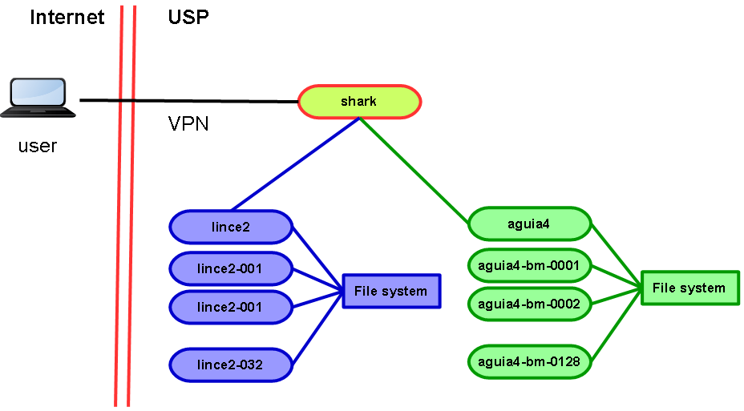

.. USP HPC documentation master file, created by
   sphinx-quickstart on Sun May  2 12:59:43 2021.
   You can adapt this file completely to your liking, but it should at least
   contain the root `toctree` directive.

Welcome to USP HPC's documentation!
===================================

High-Performance Computing (HPC) at Universidade de Sao Paulo (USP) comprises two clusters of servers with the following attributes:

* Workload manager (Slurm) that schedules jobs in all servers.
* Shared network file system visible to all servers.
* Limited local storage.
* Login node with no GPU in **lince** cluster.

Cluster **aguia** contains servers for CPU processing while **lince** cluster is for GPU processing. Access to the clusters through **shark**.

Both clusters allow parallel and distributed computing for scientific purposes, for example training of machine learning and deep learning models.

This documentation explains how to:

#. Setup a development environment for testing and debugging.
#. Schedule and manage Slurm jobs.
#. Use Python libraries to train machine learning and deep learning models.

This is a quick start guide for new users and may save several hours of searching and testing. Detailed and complete information on each topic is available in the Internet.

.. toctree::
   :maxdepth: 2
   :caption: Configuration 

   client_configuration 
   server_configuration
   install_gdrive

.. toctree::
   :maxdepth: 2
   :caption: Code Development

   debug_config
   tensorflow_settings
   gpucheck

.. toctree::
   :maxdepth: 2
   :caption: SLURM

   slurm
   custom_module

.. toctree::
   :caption: Other Information

   support
   about
   license 

