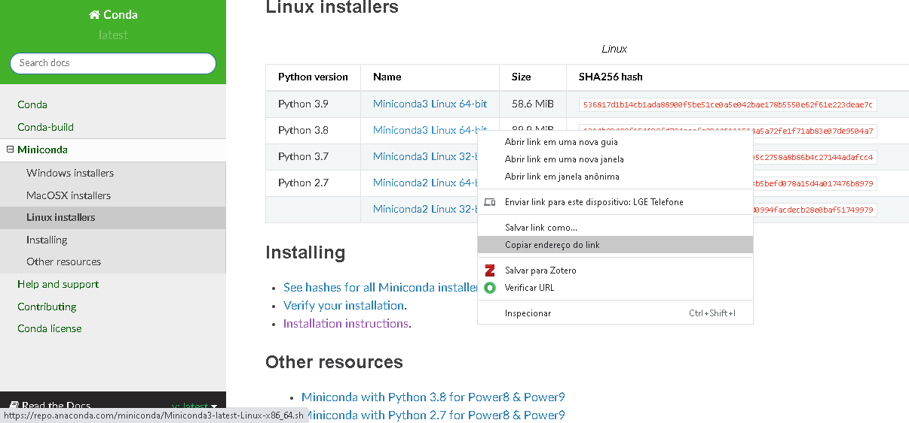

Server configuration
====================

Install Miniconda and Python libraries
--------------------------------------

Python libraries installed in HPC are outdated and you may want to use newer releases. This section shows how to install Miniconda in the user's home directory, without affecting the original installation.

Miniconda installs the most recent release of Python and ``pip`` in the user's folder. The libraries installed with ``pip`` and ``conda`` are also installed in your folder. 

All commands shall be executed in the server's Linux terminal.

Check CUDA release
^^^^^^^^^^^^^^^^^^

Before installing the libraries, you need the current CUDA release to choose the right package. Run this command::

	$ nvcc --version
	nvcc: NVIDIA (R) Cuda compiler driver
	Copyright (c) 2005-2019 NVIDIA Corporation
	Built on Wed_Apr_24_19:10:27_PDT_2019
	Cuda compilation tools, release 10.1, V10.1.168

The output shows the current release is 10.1.

	
Install Miniconda
^^^^^^^^^^^^^^^^^

Miniconda is a package management system for Python and provides ``pip``, ``conda`` and the most recent Python release with basic libraries. Miniconda requires less disk space than Anaconda and is faster to install. After installing Miniconda, you may install just the libraries that you'll use. Anaconda installs many packages and applications that won't be used.

Select a Miniconda release with the Python version compatible with the libraries that you need, since not all libraries are compatible with the newest release of Python. For example, the latest release of Tensorflow doesn't work with the latest release of Python and CUDA 10.1.

.. warning::
	Check Python, CUDA and libraries compatibility before installing Miniconda. Many libraries only work with specific Python and CUDA versions.
	
Access Miniconda `website <https://docs.conda.io/en/latest/miniconda.html#linux-installers>`_ and copy the link with the installation script that you need. This example uses release 3.8.

Use the ``wget`` command to download the script with the link you copied from Miniconda site::

	$ wget https://repo.anaconda.com/miniconda/Miniconda3-latest-Linux-x86_64.sh
	$ bash Miniconda3-latest-Linux-x86_64.sh
	
The installation script asks a few questions, just press ENTER to accept the default values and accept the license terms. When prompted to initialize Miniconda, answer "yes". This creates the default base environment that will be automatically activated when you log into the cluster. All libraries will be installed in this environment.

	Do you wish the installer to initialize Miniconda3
	by running conda init? [yes|no]
	[no] >>> yes

Now reload ``~/.bashrc`` to update the environment variables and activate the base environment::

	$ source ~/.bashrc

.. warning::
	Make sure to select the right environment before installation and always check Python and libraries after installation.
	
Install Python libraries for your project. Tensorflow and PyTorch use custom installation which depends on Python and CUDA versions::

	$ conda install -c conda-forge numpy pandas matplotlib scikit-learn 

Optionally update the libaries for the most recent version. In this example, Miniconda installed scikit-learn version 0.23 and this command upgrades to 0.24 ::

	# Update scikit-learn
	$ conda upgrade -c conda-forge scikit-learn

Install Tensorflow
^^^^^^^^^^^^^^^^^^

From `Tensorflow website <https://www.tensorflow.org/install/source#linux>`_, select the correct version according to Python and CUDA versions. Since we have Python 3.8 and CUDA 10.1, the best Tensorflow version is 2.3::

	$ pip install tensorflow==2.3

Install PyTorch
^^^^^^^^^^^^^^^

Similarly, check `PyTorch website <https://pytorch.org/>`_ to install the correct version::

	# Install PyTorch
	# 1. Version with GPU to install in lince (CUDA 10.1 - Python 3.8)
	$ conda install pytorch torchvision torchaudio cudatoolkit=10.1 -c pytorch

	# 2. Version without GPU to install in aguia
	$ conda install pytorch torchvision torchaudio cpuonly -c pytorch
      
Install Dask
^^^^^^^^^^^^

`Dask <https://dask.org/>`_ is a library for parallel and distributed computing. Dask's schedulers scale to thousand-node clusters and its algorithms have been tested on some of the largest supercomputers in the world. It easily integrates with NumPy, Pandas and scikit-learn::

	$ conda install dask distributed

Install RAPIDS
^^^^^^^^^^^^^^

The `RAPIDS <https://rapids.ai/index.html>`_ suite of open source software libraries and APIs gives you the ability to execute end-to-end data science and analytics pipelines entirely on GPUs. Use the `release selector <https://rapids.ai/start.html#get-rapids>`_ to get the right installation command::

	$ conda install -c rapidsai -c nvidia -c conda-forge rapids-blazing=0.19 python=3.8 cudatoolkit=10.1

Test installation
-----------------

After installing the libraries, run Python and import the libraries to confirm the correct version::

	$ cat system_info.py
	#!/scratch/<YOUR_NUSP>/miniconda3/bin/python3
	import sys
	import numpy as np
	import pandas as pd
	import matplotlib as mpl
	import sklearn as sk

	print('='*20, 'Software version', '='*20)
	print("Python:", sys.version.split('\n')[0])
	print("NumPy:", np.__version__)
	print("Pandas:", pd.__version__)
	print('Matplotlib:', mpl.__version__)
	print("Sklearn:", sk.__version__)

.. warning::
	Check Tensorflow, PyTorch and RAPIDS on the processing node, since the login server doesn't have access to GPU.
	
Lince login node doesn't provide GPU access, so you need to connect to a processing node to check Tensorflow, PyTorch and RAPIDS::

	$ ssh lince2-001

Once connected in lince2-001, connect to a processing node and make sure that Tensorflow and PyTorch recognize the GPU::

	$ python
	Python 3.8.5 (default, Sep  4 2020, 07:30:14)
	[GCC 7.3.0] :: Anaconda, Inc. on linux
	Type "help", "copyright", "credits" or "license" for more information.

Check Tensorflow installation
^^^^^^^^^^^^^^^^^^^^^^^^^^^^^

Import Tensorflow::

	>>> import tensorflow as tf
	2021-05-06 10:09:05.807604: I tensorflow/stream_executor/platform/default/dso_loader.cc:48] Successfully opened dynamic library libcudart.so.10.1

Check Tensorflow version::

	>>> tf.__version__
	'2.3.0'

Check if Tensorflow can list both GPUs::

	>>> tf.config.list_physical_devices()
	2021-05-06 10:09:19.154886: I tensorflow/stream_executor/platform/default/dso_loader.cc:48] Successfully opened dynamic library libcuda.so.1
	2021-05-06 10:09:19.167369: I tensorflow/core/common_runtime/gpu/gpu_device.cc:1716] Found device 0 with properties:
	pciBusID: 0000:05:00.0 name: Tesla K20m computeCapability: 3.5
	coreClock: 0.7055GHz coreCount: 13 deviceMemorySize: 4.63GiB deviceMemoryBandwidth: 193.71GiB/s
	2021-05-06 10:09:19.168426: I tensorflow/core/common_runtime/gpu/gpu_device.cc:1716] Found device 1 with properties:
	pciBusID: 0000:83:00.0 name: Tesla K20m computeCapability: 3.5
	coreClock: 0.7055GHz coreCount: 13 deviceMemorySize: 4.63GiB deviceMemoryBandwidth: 193.71GiB/s
	2021-05-06 10:09:19.168477: I tensorflow/stream_executor/platform/default/dso_loader.cc:48] Successfully opened dynamic library libcudart.so.10.1
	2021-05-06 10:09:19.173624: I tensorflow/stream_executor/platform/default/dso_loader.cc:48] Successfully opened dynamic library libcublas.so.10
	2021-05-06 10:09:19.176772: I tensorflow/stream_executor/platform/default/dso_loader.cc:48] Successfully opened dynamic library libcufft.so.10
	2021-05-06 10:09:19.177907: I tensorflow/stream_executor/platform/default/dso_loader.cc:48] Successfully opened dynamic library libcurand.so.10
	2021-05-06 10:09:19.181156: I tensorflow/stream_executor/platform/default/dso_loader.cc:48] Successfully opened dynamic library libcusolver.so.10
	2021-05-06 10:09:19.183197: I tensorflow/stream_executor/platform/default/dso_loader.cc:48] Successfully opened dynamic library libcusparse.so.10
	2021-05-06 10:09:19.188812: I tensorflow/stream_executor/platform/default/dso_loader.cc:48] Successfully opened dynamic library libcudnn.so.7
	2021-05-06 10:09:19.192994: I tensorflow/core/common_runtime/gpu/gpu_device.cc:1858] Adding visible gpu devices: 0, 1
	[PhysicalDevice(name='/physical_device:CPU:0', device_type='CPU'), PhysicalDevice(name='/physical_device:XLA_CPU:0', device_type='XLA_CPU'), PhysicalDevice(name='/physical_device:XLA_GPU:0', device_type='XLA_GPU'), PhysicalDevice(name='/physical_device:XLA_GPU:1', device_type='XLA_GPU'), PhysicalDevice(name='/physical_device:GPU:0', device_type='GPU'), PhysicalDevice(name='/physical_device:GPU:1', device_type='GPU')]

Check PyTorch installation
^^^^^^^^^^^^^^^^^^^^^^^^^^

Import PyTorch::

	>>> import torch

Check PyTorch version::

	>>> torch.__version__
	'1.7.0'
	>>>

Check the number of GPUs available::

	>>> torch.cuda.device_count()
	2

Check GPU name::	
	
	>>> torch.cuda.get_device_name(torch.cuda.current_device())
	'Tesla K20m'

Check RAPIDS installation
^^^^^^^^^^^^^^^^^^^^^^^^^

RAPIDS automatically detects the GPU when you import a library::

	>>> import cudf
	/scratch/11568881/miniconda3/lib/python3.8/site-packages/cudf/utils/gpu_utils.py:92: UserWarning: You will need a GPU with NVIDIA Pascal™ or newer architecture
	Detected GPU 0: Tesla K20m
	Detected Compute Capability: 3.5
	  warnings.warn(

System information
------------------

You may need the hardware information to choose the right software release. The following commands show the main hardware devices and the Linux release. The commands may be executed directly in the Linux terminal, or you may save in a script and run in SLURM job. Note that PyTorch provides a custom version for each CUDA version::

	$ cat system_info.sh
	#!/usr/bin/bash
	echo ========================
	echo SLURM: ID of job allocation
	echo ========================
	echo $SLURM_JOB_ID              # ID of job allocation

	echo ========================
	echo SLURM: Directory job where was submitted
	echo ========================
	echo $SLURM_SUBMIT_DIR          # Directory job where was submitted

	echo ========================
	echo SLURM: File containing allocated hostnames
	echo ========================
	echo $SLURM_JOB_NODELIST        # File containing allocated hostnames

	echo ========================
	echo SLURM: Total number of cores for job
	echo ========================
	echo $SLURM_NTASKS              # Total number of cores for job

	echo ========================
	echo SLURM: GPU devide ID that assigned to the job to use
	echo ========================
	echo $CUDA_VISIBLE_DEVICES

	echo ========================
	echo Hostname
	echo ========================
	hostname

	echo ========================
	echo Memory Info \(GB\):
	echo ========================
	free -g

	echo ========================
	echo CPU Info:
	echo ========================
	lscpu

	echo ========================
	echo Disk space
	echo ========================
	df -h

	echo ========================
	echo GPU 1
	echo ========================
	nvidia-smi

	echo ========================
	echo GPU 2
	echo ========================
	lshw -C display

	echo ========================
	echo CUDA Version
	echo ========================
	nvcc --version

	echo ========================
	echo Linux version
	echo ========================
	cat /etc/os-release

	echo ========================
	echo PATH
	echo ========================
	echo $PATH

	echo ========================
	echo Python
	echo ========================
	which python
	which python3

	echo ========================
	echo Conda
	echo ========================
	which conda
	conda --version

	echo ========================
	echo Pip
	echo ========================
	which pip
	pip --version

	echo ========================
	echo Python Library Versions
	echo ========================
	python system_info.py

