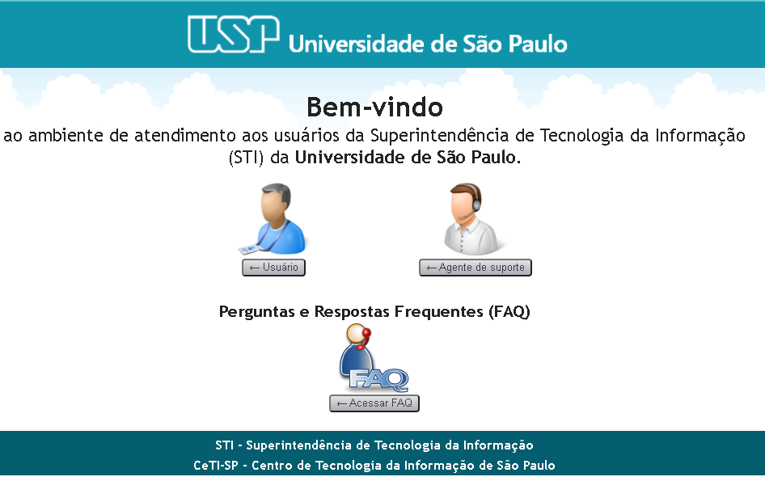
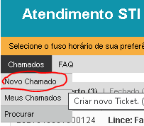
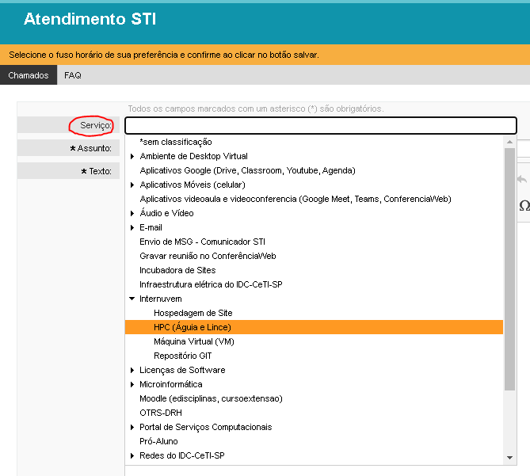

Getting Support
===============

Before getting support, check the `FAQ <https://atendimentosti.usp.br/otrs/customer.pl?Action=CustomerFAQExplorer>`_ page.

If you need support for shark, aguia or lince, access the support `website <https://atendimentosti.usp.br/>`_ and click in **Usuário**:

Then log into **sistema USP** and click "Chamados->Novo Chamado"

 
Under "Serviço:" select "Internuvem->HPC (Águia e Lince)"

 

